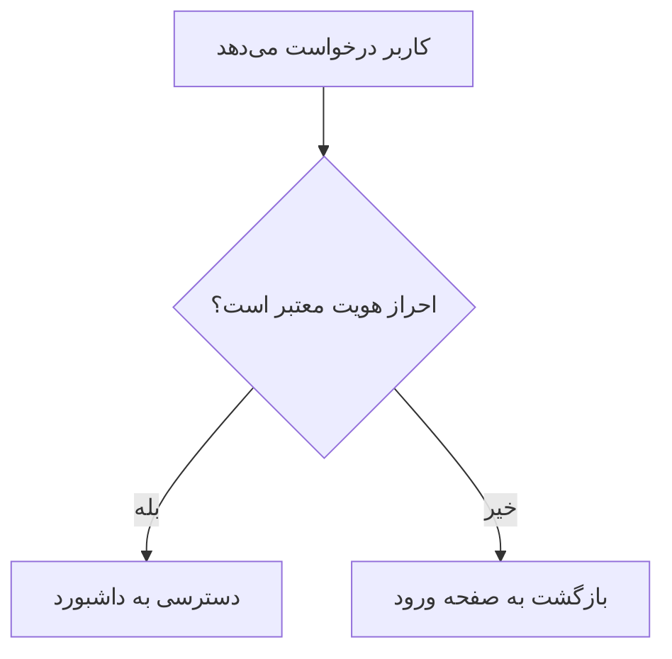

# راهنمای جامع نوشتن README.md حرفه‌ای در گیت‌هاب

این سند یک مرجع کامل و آموزشی برای نوشتن فایل‌های `README.md` است. تمام syntax های مهم مارک‌داون گیت‌هاب (GitHub Flavored Markdown) به همراه مثال‌های واقعی و کاربردی در آن آورده شده تا بتوانید یک README حرفه‌ای، رسمی و قابل‌اعتماد برای پروژه‌ها یا محصولات خود بسازید.

> **نکته:** فایل README.md همیشه باید در ریشه (root) مخزن گیت‌هاب قرار بگیرد تا به‌صورت خودکار در صفحه اصلی پروژه نمایش داده شود.

---

## فهرست مطالب

- [۱. ساختار کلی یک README حرفه‌ای](#۱-ساختار-کلی-یک-readme-حرفهای)
- [۲. تیترها و سرفصل‌ها (Headings)](#۲-تیترها-و-سرفصلها-headings)
- [۳. استایل متن (Bold, Italic, Strikethrough)](#۳-استایل-متن-bold-italic-strikethrough)
- [۴. بج‌ها / نشان‌ها (Badges)](#۴-بجها--نشانها-badges)
- [۵. لینک‌ها و تصاویر](#۵-لینکها-و-تصاویر)
- [۶. بلوک‌های کد (Code Blocks)](#۶-بلوکهای-کد-code-blocks)
- [۷. لیست‌ها (Ordered / Unordered / Task List)](#۷-لیستها-ordered--unordered--task-list)
- [۸. جدول‌ها (Tables)](#۸-جدولها-tables)
- [۹. نقل‌قول‌ها و هشدارها (Blockquotes & Alerts)](#۹-نقلقولها-و-هشدارها-blockquotes--alerts)
- [۱۰. بخش‌های تاشو (Collapsible Sections)](#۱۰-بخشهای-تاشو-collapsible-sections)
- [۱۱. خط جداکننده و فاصله‌گذاری](#۱۱-خط-جداکننده-و-فاصلهگذاری)
- [۱۲. دیاگرام با Mermaid](#۱۲-دیاگرام-با-mermaid)
- [۱۳. الگوی کامل یک README واقعی](#۱۳-الگوی-کامل-یک-readme-واقعی)
- [۱۴. نکات حرفه‌ای و اصول طلایی](#۱۴-نکات-حرفهای-و-اصول-طلایی)

---

## ۱. ساختار کلی یک README حرفه‌ای

یک README استاندارد معمولاً شامل این بخش‌هاست (به همین ترتیب):

| ترتیب | بخش | هدف |
|---|---|---|
| ۱ | عنوان و لوگو | معرفی سریع پروژه |
| ۲ | بج‌ها (Badges) | نمایش وضعیت بیلد، نسخه، لایسنس |
| ۳ | توضیح کوتاه (Tagline) | یک جمله درباره اینکه پروژه چیست |
| ۴ | فهرست مطالب | ناوبری سریع در سند |
| ۵ | ویژگی‌ها (Features) | چه کاری انجام می‌دهد |
| ۶ | نصب (Installation) | چگونه راه‌اندازی شود |
| ۷ | نحوه استفاده (Usage) | مثال‌های عملی |
| ۸ | مستندات API (در صورت وجود) | جزئیات فنی |
| ۹ | مشارکت (Contributing) | راهنمای همکاری |
| ۱۰ | لایسنس | مجوز استفاده |
| ۱۱ | تماس / تشکر | اطلاعات نویسنده |

---

## ۲. تیترها و سرفصل‌ها (Headings)

از `#` برای تیترها استفاده می‌شود؛ تعداد `#` سطح تیتر را مشخص می‌کند (از H1 تا H6).

```markdown
# تیتر سطح ۱ (عنوان اصلی پروژه)
## تیتر سطح ۲ (بخش‌های اصلی)
### تیتر سطح ۳ (زیربخش)
#### تیتر سطح ۴
```

**خروجی:**

# تیتر سطح ۱
## تیتر سطح ۲
### تیتر سطح ۳

> در یک README فقط **یک** تیتر سطح ۱ (`#`) استفاده کنید؛ آن هم برای نام پروژه.

---

## ۳. استایل متن (Bold, Italic, Strikethrough)

```markdown
**متن بولد (پررنگ)**
*متن ایتالیک (کج)*
***بولد و ایتالیک با هم***
~~متن خط‌خورده~~
`کد درون‌خطی (inline code)`
```

**خروجی:**

**متن بولد** · *متن ایتالیک* · ***بولد و ایتالیک*** · ~~خط‌خورده~~ · `کد درون‌خطی`

---

## ۴. بج‌ها / نشان‌ها (Badges)

بج‌ها معمولاً از سرویس [Shields.io](https://shields.io) ساخته می‌شوند و اطلاعاتی مثل نسخه، وضعیت بیلد، لایسنس و تعداد دانلود را نمایش می‌دهند.

```markdown


```

**کاربرد رسمی و متداول (چند بج کنار هم در بالای README):**

```markdown
[](https://www.npmjs.com/package/react)
[](https://github.com/facebook/react/blob/main/LICENSE)
[](https://github.com/facebook/react/actions)
```

> نکته: قرار دادن بج داخل `[...]()` باعث می‌شود با کلیک روی بج، کاربر به صفحه مرتبط هدایت شود.

---

## ۵. لینک‌ها و تصاویر

### لینک ساده
```markdown
[متن لینک](https://example.com)
```

### تصویر
```markdown

```

### تصویر با لینک (کلیک‌پذیر)
```markdown
[](https://example.com)
```

### تصویر با سایز مشخص (با تگ HTML، چون مارک‌داون خالص سایز پشتیبانی نمی‌کند)
```html

```

### قرار دادن لوگو و تصویر در وسط صفحه
```html
<p align="center">
  
</p>

<h1 align="center">نام پروژه</h1>
<p align="center">یک جمله توضیح کوتاه درباره پروژه</p>
```

---

## ۶. بلوک‌های کد (Code Blocks)

برای کد از بک‌تیک (backtick) استفاده می‌شود. با نوشتن نام زبان بعد از سه بک‌تیک، رنگ‌بندی سینتکسی (Syntax Highlighting) فعال می‌شود.

**Bash:**
````markdown
```bash
npm install my-package
```
````

**JavaScript:**
````markdown
```javascript
function greet(name) {
  return `سلام ${name}`;
}
```
````

**Python:**
````markdown
```python
def greet(name: str) -> str:
    return f"سلام {name}"
```
````

زبان‌های رایج دیگر: `json` ، `yaml` ، `html` ، `css` ، `sql` ، `dockerfile` ، `typescript`

---

## ۷. لیست‌ها (Ordered / Unordered / Task List)

### لیست بدون ترتیب
```markdown
- ویژگی اول
- ویژگی دوم
  - زیرمورد
- ویژگی سوم
```

### لیست مرتب (شماره‌دار)
```markdown
1. مرحله اول
2. مرحله دوم
3. مرحله سوم
```

### چک‌لیست (Task List) — بسیار پرکاربرد در بخش نقشه راه (Roadmap)
```markdown
- [x] پیاده‌سازی احراز هویت
- [x] اتصال به دیتابیس
- [ ] افزودن پنل ادمین
- [ ] نوشتن تست‌های واحد
```

**خروجی:**
- [x] پیاده‌سازی احراز هویت
- [ ] افزودن پنل ادمین

---

## ۸. جدول‌ها (Tables)

```markdown
| نام پارامتر | نوع داده | توضیح | اجباری |
|---|---|---|---|
| `apiKey` | `string` | کلید دسترسی به API | بله |
| `timeout` | `number` | زمان انتظار به میلی‌ثانیه | خیر |
| `retries` | `number` | تعداد تلاش مجدد | خیر |
```

**خروجی:**

| نام پارامتر | نوع داده | توضیح | اجباری |
|---|---|---|---|
| `apiKey` | `string` | کلید دسترسی به API | بله |
| `timeout` | `number` | زمان انتظار به میلی‌ثانیه | خیر |

> برای چیدمان (چپ/راست/وسط)، از `:---` ، `:---:` و `---:` در خط جداکننده استفاده کنید.

---

## ۹. نقل‌قول‌ها و هشدارها (Blockquotes & Alerts)

### نقل‌قول ساده
```markdown
> این یک نقل‌قول است و معمولاً برای نکات مهم استفاده می‌شود.
```

### هشدارهای رسمی گیت‌هاب (GitHub Alerts) — جدیدترین و رایج‌ترین روش

```markdown
> [!NOTE]
> اطلاعات مفید و مکمل برای کاربر.

> [!TIP]
> یک پیشنهاد یا میان‌بر مفید.

> [!IMPORTANT]
> اطلاعاتی که کاربر حتماً باید بداند.

> [!WARNING]
> نکته‌ای که نیاز به توجه فوری دارد.

> [!CAUTION]
> احتمال خطر یا نتیجه منفی در صورت نادیده گرفتن.
```

این پنج نوع هشدار به‌صورت خودکار در گیت‌هاب با رنگ و آیکون مخصوص به خودشان (آبی، سبز، بنفش، زرد، قرمز) نمایش داده می‌شوند.

---

## ۱۰. بخش‌های تاشو (Collapsible Sections)

برای پنهان کردن محتوای طولانی (مثل لاگ خطا یا FAQ) از تگ `<details>` استفاده می‌شود:

```html
<details>
<summary>برای مشاهده جزئیات نصب کلیک کنید</summary>

### مراحل نصب

1. مخزن را کلون کنید
2. دستور `npm install` را اجرا کنید
3. فایل `.env` را تنظیم کنید

</details>
```

> **نکته مهم:** حتماً بعد از `<summary>` یک خط خالی بگذارید، در غیر این صورت مارک‌داون داخل آن رندر نمی‌شود.

---

## ۱۱. خط جداکننده و فاصله‌گذاری

```markdown
---
```
یا

```markdown
***
```

هر دو یک خط افقی جداکننده بین بخش‌ها ایجاد می‌کنند (همان‌طور که در این سند بارها استفاده شده است).

---

## ۱۲. دیاگرام با Mermaid

گیت‌هاب به‌صورت بومی از دیاگرام‌های Mermaid پشتیبانی می‌کند؛ مناسب برای نمایش معماری سیستم یا فلوچارت:

````markdown

````

---

## ۱۳. الگوی کامل یک README واقعی

در ادامه یک نمونه کامل و آماده که می‌توانید مستقیماً کپی و شخصی‌سازی کنید:

````markdown
<p align="center">
  
</p>

<h1 align="center">نام پروژه</h1>
<p align="center">یک توضیح یک‌خطی حرفه‌ای درباره اینکه این پروژه چه مشکلی را حل می‌کند</p>

<p align="center">
  <a href="https://github.com/username/repo/actions"></a>
  <a href="https://github.com/username/repo/blob/main/LICENSE"></a>
  <a href="https://github.com/username/repo/releases"></a>
</p>

---

## فهرست مطالب

- [ویژگی‌ها](#ویژگیها)
- [پیش‌نیازها](#پیشنیازها)
- [نصب](#نصب)
- [نحوه استفاده](#نحوه-استفاده)
- [مستندات API](#مستندات-api)
- [مشارکت](#مشارکت)
- [لایسنس](#لایسنس)

## ویژگی‌ها

- ⚡️ سریع و بهینه
- 🔒 امن و مبتنی بر استانداردهای روز
- 🌐 پشتیبانی کامل از چند زبان

## پیش‌نیازها

- Node.js نسخه ۱۸ به بالا
- npm یا yarn

## نصب

```bash
git clone https://github.com/username/repo.git
cd repo
npm install
```

## نحوه استفاده

```javascript
import { myFunction } from 'my-package';

myFunction();
```

## مستندات API

| متد | توضیح |
|---|---|
| `init()` | راه‌اندازی اولیه |
| `run()` | اجرای فرآیند اصلی |

## مشارکت

> [!TIP]
> قبل از ارسال Pull Request، فایل CONTRIBUTING.md را مطالعه کنید.

1. فورک کنید
2. یک برنچ جدید بسازید (`git checkout -b feature/x`)
3. تغییرات را کامیت کنید
4. Pull Request ارسال کنید

## لایسنس

این پروژه تحت لایسنس [MIT](LICENSE) منتشر شده است.
````

---

## ۱۴. نکات حرفه‌ای و اصول طلایی

1. **کوتاه و شفاف بنویسید** — README محل توضیح کامل فنی نیست؛ برای جزئیات زیاد از پوشه `docs/` استفاده کنید.
2. **همیشه یک اسکرین‌شات یا GIF** از محصول قرار دهید؛ تأثیر بصری بسیار بیشتر از متن است.
3. **بخش نصب باید کپی‌پیست‌شونده باشد** — دستورات را داخل بلوک کد بگذارید، نه متن ساده.
4. **از بج‌ها زیاده‌روی نکنید** — بین ۳ تا ۶ بج کافی است.
5. **فهرست مطالب برای README های بلند ضروری است.**
6. **لایسنس را همیشه ذکر کنید**، حتی اگر MIT ساده باشد.
7. **در پروژه‌های فارسی/RTL**، از تگ‌های HTML مثل `<p align="right">` برای کنترل بهتر جهت متن در بخش‌هایی مانند لوگو استفاده کنید (خود مارک‌داون کنترل RTL خودکار ندارد و جهت‌گیری به تنظیمات مرورگر/گیت‌هاب بستگی دارد).
8. **نام فایل باید دقیقاً `README.md`** باشد (حروف بزرگ) تا گیت‌هاب آن را به‌طور خودکار شناسایی کند.
